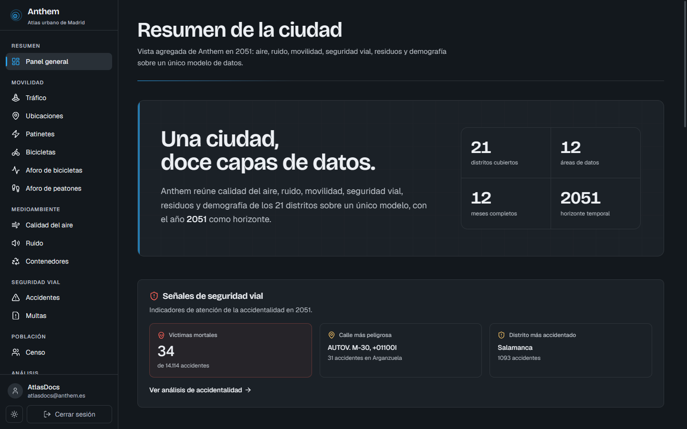
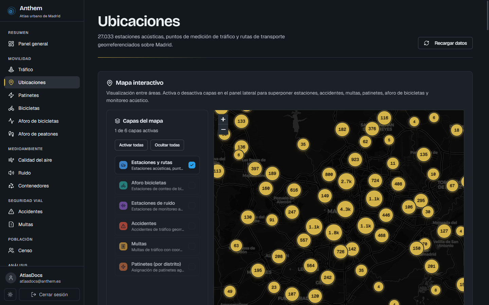
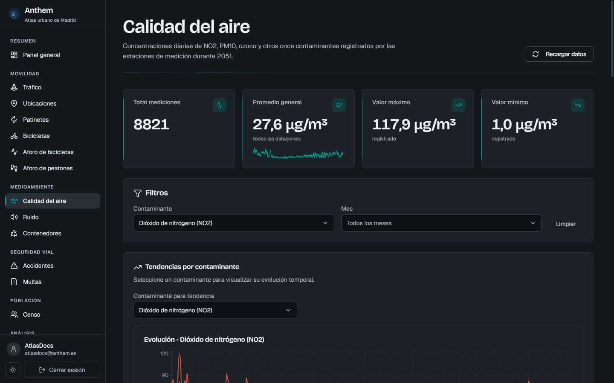
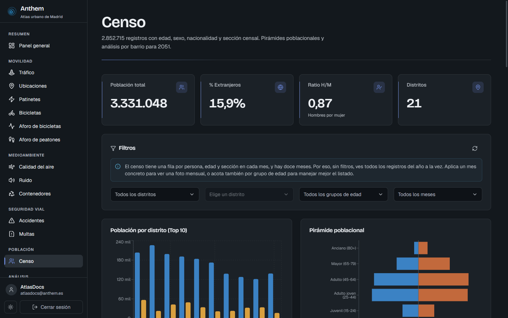
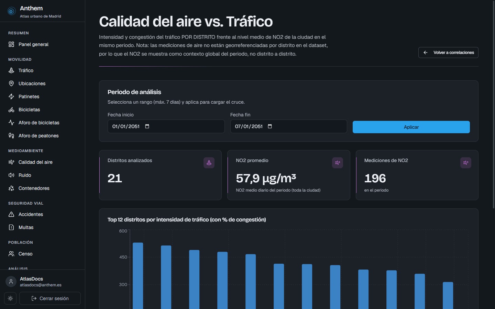
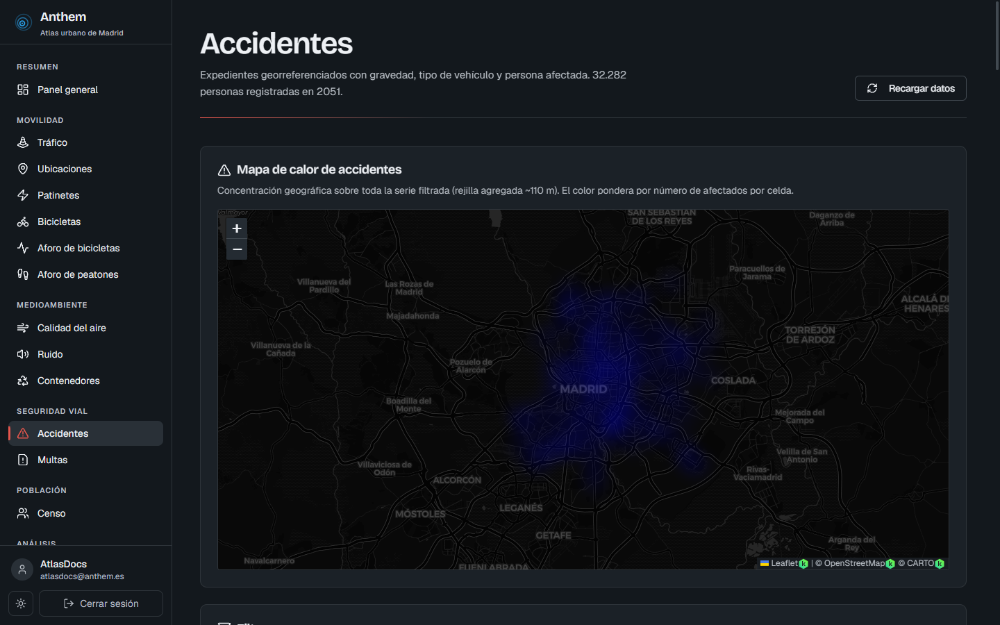
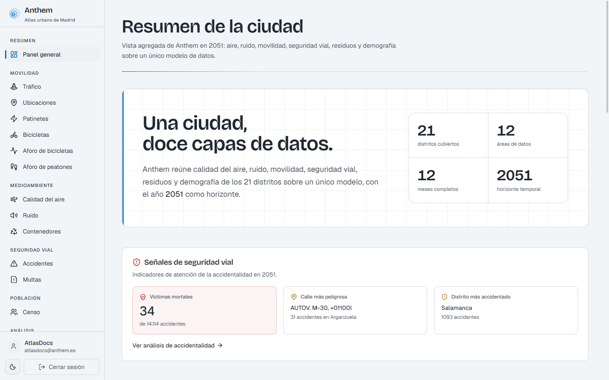
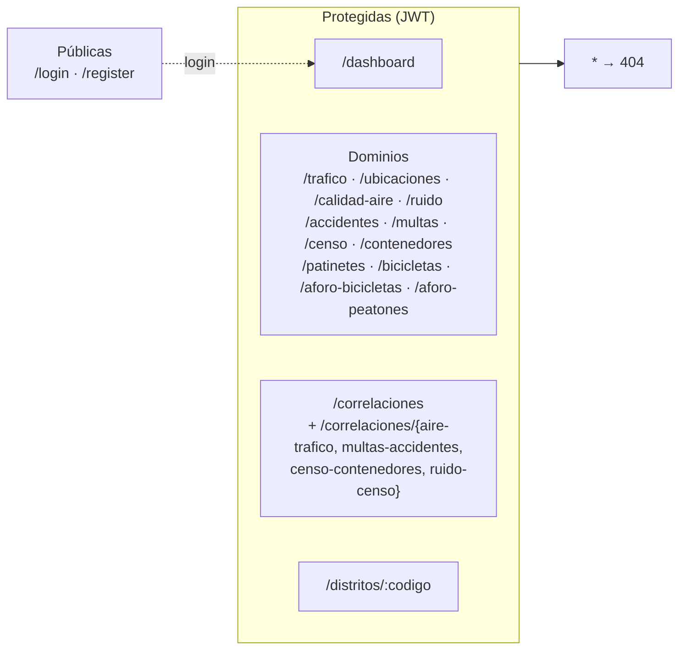
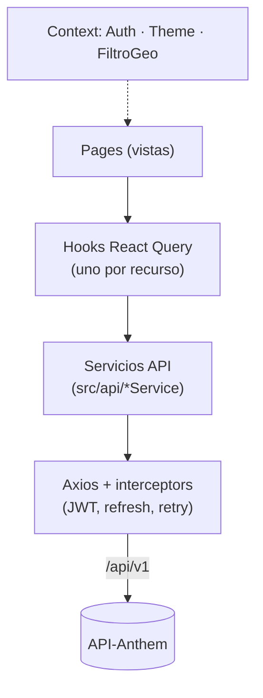

<div align="center">

# Anthem · Atlas urbano de Madrid

**Dashboard interactivo de la Smart City de Anthem (Madrid simulado, año 2051).**
React 19 + Vite 7 + Tailwind v4. Mapas, series temporales y análisis cruzado sobre los datos que
sirve la [API-Anthem](https://github.com/Samuel-Prog-CSec/API-Anthem).




</div>

---

## Tabla de contenidos

- [Descripción general](#descripción-general)
- [Capturas](#capturas)
- [Características destacadas](#características-destacadas)
- [Stack tecnológico](#stack-tecnológico)
- [Requisitos y puesta en marcha](#requisitos-y-puesta-en-marcha)
- [Variables de entorno](#variables-de-entorno)
- [Scripts npm](#scripts-npm)
- [Rutas / navegación](#rutas--navegación)
- [Conexión con el backend](#conexión-con-el-backend)
- [Arquitectura frontend](#arquitectura-frontend)
- [Diseño y tema](#diseño-y-tema)
- [Rendimiento](#rendimiento)
- [Seguridad](#seguridad)
- [Estructura del proyecto](#estructura-del-proyecto)
- [Documentación complementaria](#documentación-complementaria)

---

## Descripción general

**Anthem** es el atlas de datos abiertos de una Madrid ficticia en **2051**. Este frontend es una
SPA que reúne, sobre un único modelo georreferenciado, doce áreas de datos —calidad del aire,
ruido, tráfico, accidentalidad, multas, censo, residuos, movilidad blanda y aforos— de los **21
distritos**, con mapas, gráficos y vistas de **análisis cruzado** entre dominios.

Consume la API REST de [**API-Anthem**](https://github.com/Samuel-Prog-CSec/API-Anthem); no funciona sin ella en marcha.

## Capturas

| | |
| --- | --- |
|  |  |
| **Mapa clusterizado** (CARTO dark) con capas temáticas | **Calidad del aire**: KPIs y series por contaminante |
|  |  |
| **Censo**: pirámide poblacional y población por distrito | **Correlaciones (BI)**: cruce aire ↔ tráfico |
|  |  |
| **Accidentes**: mapa de calor georreferenciado | **Tema claro**: el mismo panel, tema dual |

> Las imágenes están en [`docs/img/`](docs/img). Hay también capturas de tráfico, ruido (tema
> claro), el hub de correlaciones y la pantalla de login.

## Características destacadas

- **Mapas interactivos (Leaflet)**: clusterizado por dominio, mapas de calor (tráfico, accidentes)
  y carga **por viewport** (contenedores). Basemaps **CARTO** que cambian con el tema (dark/light).
- **Gráficos (Recharts)**: líneas, barras y dispersión para series temporales y análisis bivariante,
  con animaciones de *count-up* en las cifras hero.
- **Análisis cruzado / BI**: cuatro cruces entre dominios (aire↔tráfico, multas↔accidentes,
  censo↔contenedores, ruido↔censo) más un hub y una vista por distrito (*drill-down*).
- **Tema dual claro/oscuro** con identidad propia (*Atlas Cívico*) y anti-FOUC (sin parpadeo).
- **Autenticación JWT** con *access token* en memoria y *refresh* automático vía cookie httpOnly.
- **React Query** para caché de servidor, *prefetch* y transiciones suaves entre vistas.
- **Accesible y responsive**: navegación por teclado, *skip link*, *drawer* en móvil, grid fluido.

## Stack tecnológico

| Área | Tecnología | Versión |
| --- | --- | --- |
| UI | React | 19 |
| Build | Vite (SWC) | 7 |
| Estilos | Tailwind CSS | v4 |
| Componentes | Radix UI + patrón shadcn/ui (CVA · clsx · tailwind-merge) | — |
| Datos | TanStack Query (React Query) | 5 |
| HTTP | Axios | 1.13 |
| Routing | React Router | 7 |
| Gráficos | Recharts | 3 |
| Mapas | Leaflet + react-leaflet + cluster + heat | 1.9 / 5 |
| Iconos | Lucide React | — |
| Auth | jwt-decode | 4 |
| Servidor prod | Express + Helmet + compression (`server.cjs`) | — |

> Node mínimo: **≥ 20**.

## Requisitos y puesta en marcha

```bash
# 1. Instalar dependencias
npm install

# 2. Configurar el entorno (opcional; ver valores por defecto abajo)
cp .env.example .env

# 3. Arrancar el servidor de desarrollo
npm run dev
```

- App en **http://localhost:5173** (Vite, con HMR).
- Requiere la **[API-Anthem](https://github.com/Samuel-Prog-CSec/API-Anthem) corriendo** en `http://localhost:3000` (por defecto).

## Variables de entorno

| Variable | Entorno | Valor |
| --- | --- | --- |
| `VITE_API_BASE_URL` | Local (por defecto) | `http://localhost:3000/api/v1` |
| `VITE_API_BASE_URL` | Render (desplegado) | `https://api-anthem.onrender.com/api/v1` |

### ¿A qué API apunta el dashboard? (local vs. Render)

`VITE_API_BASE_URL` es la variable que decide **de dónde lee los datos** el frontend. **Defínela**
en `.env` según dónde esté tu backend:

```bash
# A) API en LOCAL (backend corriendo en tu máquina)
VITE_API_BASE_URL=http://localhost:3000/api/v1

# B) API desplegada en Render (u otro host)
VITE_API_BASE_URL=https://<tu-api>.onrender.com/api/v1
```

> ⚠️ Es una variable **de build** (`import.meta.env`): Vite la "hornea" al compilar. En desarrollo
> (`npm run dev`) basta con tenerla en `.env`. Para producción, **defínela antes de `npm run build`**
> (en Render, como variable de entorno); si la cambias, hay que **reconstruir** (`npm run build`).
> Asegúrate además de que el origen del frontend está en el `CORS_ORIGINS` del backend.

> Nota: usa `localhost` (no `127.0.0.1`) en local; es el host que el navegador alcanza de forma
> fiable y para el que el backend tiene habilitado CORS.

## Scripts npm

| Comando | Acción |
| --- | --- |
| `npm run dev` | Servidor de desarrollo (Vite + HMR) en `:5173`. |
| `npm run build` | Build de producción a `dist/` (+ `dist/stats.html`, análisis de bundle). |
| `npm run preview` | Sirve el build localmente en `:4173`. |
| `npm start` | Servidor de producción Express (`server.cjs`) con CSP y compresión. |
| `npm run lint` | Linting con ESLint. |

## Rutas / navegación



Las rutas no autenticadas redirigen a `/login`; las públicas, si ya hay sesión, redirigen a
`/dashboard`.

## Conexión con el backend

- **Base URL**: `VITE_API_BASE_URL` (dev: `http://localhost:3000/api/v1`).
- **Autenticación**: el `accessToken` se guarda en memoria (nunca en `localStorage`); el
  `refreshToken` viaja en cookie httpOnly. Un interceptor de Axios añade el header `Authorization`
  y renueva el token de forma anticipada antes de que expire.
- **Formato de respuesta** (paginación *offset*):

```jsonc
{ "success": true, "message": "...", "data": [],
  "pagination": { "currentPage": 1, "totalPages": 42, "hasNextPage": true } }
```

  Para listados grandes, el backend usa paginación por **cursor**
  (`pagination.mode = "cursor"`, `nextCursor`). Los endpoints `/mapa` devuelven `FeatureCollection`
  GeoJSON (RFC 7946) para Leaflet.

## Arquitectura frontend



- **Servicios** (`src/api/`): un módulo por dominio que encapsula las llamadas.
- **Hooks** (`src/api/hooks/`): React Query por recurso (caché, *prefetch*, reintentos).
- **Context**: `AuthContext` (sesión), `ThemeContext` (tema), `FiltroGeoContext` (filtros geográficos).

## Diseño y tema

Identidad *Atlas Cívico*: lenguaje cartográfico (curvas de nivel en el *wordmark*), no “terminal”
genérica.

- **Tipografía**: Bricolage Grotesque (titulares y cifras hero), Geist (interfaz), Geist Mono (datos).
- **Color por dominio**: movilidad (cobalto), aire (verde/cian), ruido (violeta), residuos (marrón),
  seguridad vial (rojo/ámbar), demografía y análisis con sus acentos.
- **Tema dual**: oscuro por defecto (plano nocturno) y claro (blanco técnico), con basemaps CARTO
  acordes y conmutación sin parpadeo (FOUC).

Detalle en [`docs/Design_System.md`](docs/Design_System.md).

## Rendimiento

*Code splitting* en chunks (vendor, query, charts, maps, icons…), *lazy loading* de rutas con
`React.lazy` + `Suspense`, *prefetch* en hover, caché de React Query y CSS dividido por chunk.
Detalle en [`docs/Performance.md`](docs/Performance.md).

## Seguridad

`accessToken` en memoria, `refreshToken` en cookie httpOnly, prevención de XSS (sin
`dangerouslySetInnerHTML`) y, en producción, **CSP estricta** (hash SHA-256 de los scripts inline,
sin `unsafe-inline`) servida por `server.cjs`. Detalle en [`docs/Security.md`](docs/Security.md).

## Estructura del proyecto

```text
Frontend-Anthem/
├── src/
│   ├── api/            # servicios Axios + hooks React Query por recurso
│   ├── components/     # common/ · layout/ · mapas/ (Leaflet) · charts/ (Recharts)
│   ├── pages/          # una carpeta por vista (Dashboard, dominios, Correlaciones, Distrito, Auth)
│   ├── context/        # AuthContext · ThemeContext · FiltroGeoContext
│   ├── constants/      # constantes del frontend
│   ├── utils/          # helpers (cn, formatters)
│   └── App.jsx         # rutas
├── docs/               # Design_System · Performance · Security · Backend_Integration · Deploy_Heroku
│   └── img/            # capturas usadas en este README
├── server.cjs          # servidor estático de producción (Express + CSP)
└── vite.config.js
```

## Documentación complementaria

- [`docs/Design_System.md`](docs/Design_System.md) — sistema de diseño (color, tipografía, componentes).
- [`docs/Backend_Integration.md`](docs/Backend_Integration.md) — integración con la API.
- [`docs/Performance.md`](docs/Performance.md) — optimizaciones de rendimiento.
- [`docs/Security.md`](docs/Security.md) — seguridad en el frontend.
- [API-Anthem](https://github.com/Samuel-Prog-CSec/API-Anthem) — backend que alimenta este dashboard.

---

<div align="center">

Proyecto universitario · Smart City **Anthem 2051** · Autor: **Samuel Blanchart Pérez**

</div>
